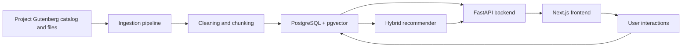

# Architecture

## Product Shape

The app has three main loops:

1. Discovery: users see personalized rows such as For You, Romance, Epic Poetry, and Because You Like...
2. Reading: users open excerpts or full works, save progress, and react with likes, dislikes, and saves.
3. Learning: recommendation quality improves as the system blends content similarity with interaction data.

## System Components

## Backend

The backend owns:

- Gutenberg metadata and source tracking.
- Raw-to-clean text conversion.
- Excerpt generation.
- Embedding generation and vector storage.
- Recommendation ranking.
- User preferences and interaction events.

## Frontend

The frontend owns:

- Account/onboarding flow.
- Personalized discovery homepage.
- Genre and theme rows.
- Reader experience.
- Profile and preference controls.
- Messaging and posting placeholders for later social features.

## Data Model Summary

- `Work`: a whole literary work.
- `Excerpt`: a recommendation/display unit derived from a work.
- `User`: account profile.
- `UserPreference`: onboarding choices.
- `Interaction`: likes, saves, reads, skips, and other behavior.
- `UserSubmission`: original literature posted by users.

